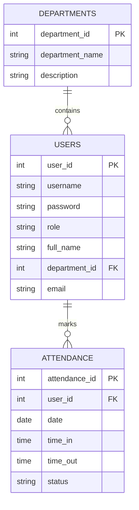

## Simple Attendance Management System ER Diagram

This simplified Entity-Relationship diagram shows the core entities and their relationships:

### Entities

1. USERS
   - Stores basic user information
   - Contains login credentials and personal details
   - Links to department

2. DEPARTMENTS
   - Basic department information
   - Groups users by their department

3. ATTENDANCE
   - Records daily attendance
   - Tracks check-in and check-out times
   - Maintains attendance status

### Relationships

- One DEPARTMENT can have many USERS
- One USER can have many ATTENDANCE records

### Basic Business Rules

1. Each user must belong to a department
2. Each attendance record must be linked to a user
3. Attendance records store daily time-in and time-out data 